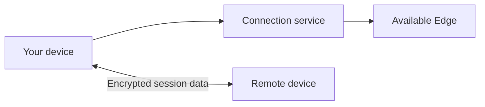

# How Saccadia Remote Works

Saccadia Remote separates connection setup from the remote desktop data itself. This separation is
the main reason the service can be both private and inexpensive to operate.

## The connection service

When the application starts, it contacts a Coordinator. The Coordinator recognizes the device and
directs it to an available Edge server. The Edge keeps the small signalling connection used to
start sessions, check availability, and arrange relay paths.

The Coordinator remains responsible for deciding which registered device is online and whether a
connection can be prepared. Edge servers spread long-lived connections across machines. Adding an
Edge therefore adds connection capacity without placing all client connections on one central
process.

Neither Coordinator nor Edge is a remote desktop viewer. They do not decode the screen, play the
sound, inspect the clipboard, or open transferred files.

## Relay paths

Devices on the Internet cannot always contact each other directly. Firewalls, routers, mobile
networks, or provider restrictions may require another device or server to forward packets.

A relay receives an already encrypted packet and forwards it. It does not receive the key needed
to decrypt the session. The packet contents remain protected whether the path uses a participating
client relay or the fallback server relay.

Saccadia Remote can prepare more than one path for a session. If one route becomes slow or
unavailable, another route can be used without treating the relay as a trusted reader of the data.
Relay use is limited by configuration; an online computer is not intended to become an unlimited
public traffic server.

Coordinator chooses exactly one route independently for each device-to-relay leg. A device uses
IPv4 loopback for its own relay service, one exact private endpoint when registered interface
prefixes show a shared LAN, and UDP rendezvous/hole punching for different subnets. Clients do not
receive a list of LAN/public alternatives and do not silently fall back between those route classes.
If the selected leg cannot pair and confirm end-to-end encryption, it fails visibly and Coordinator
replaces the assignment through the normal recovery path.

Each assignment belongs to one exact relay-listener generation. If that relay client is updated,
restarted, or reconnects, the Coordinator invalidates only the open sessions that used the old
generation and gives them a fresh assignment when the replacement is ready. A reverse index makes
this work proportional to the affected sessions rather than requiring a scan of every active
session. Old route tokens, leases, and failure cooldowns cannot be applied to the replacement
listener merely because it has the same device ID.

When one session path fails, Coordinator sends both participants one generation-safe replacement
that names the exact obsolete allocation. Each endpoint atomically exchanges that assignment slot,
so different local timeout ordering cannot leave one side at four old/new paths while the other side
has only three. A repeated replacement is harmless, and a stale replacement cannot evict an
unrelated newer path. The fallback server relay therefore remains a fallback instead of appearing
only because one participant rejected a valid client-relay replacement at capacity.

## What is stored centrally

The server keeps the minimum registration and connection information needed to operate the
service, such as a public device identity and recent availability. Current connections and relay
assignments are short-lived operational state.

The server does not store remote desktop recordings, screenshots, audio, keystrokes, clipboard
contents, chats, or transferred files as part of normal signalling.

## Why the central infrastructure stays small

Traditional relay services may carry every screen and audio byte through their own servers.
Saccadia Remote normally keeps that traffic away from the central connection service. An idle
online device mainly needs a small signalling connection and a compact online record.

This means that connection capacity can be expanded by adding Edge servers, while expensive media
bandwidth remains distributed. The fallback server relay is available when other paths cannot be
used, but it is not the preferred route for every session.

For the security boundary behind this design, read [Security](SECURITY.md). For information about
data visible to operators, read [Privacy](PRIVACY.md).
