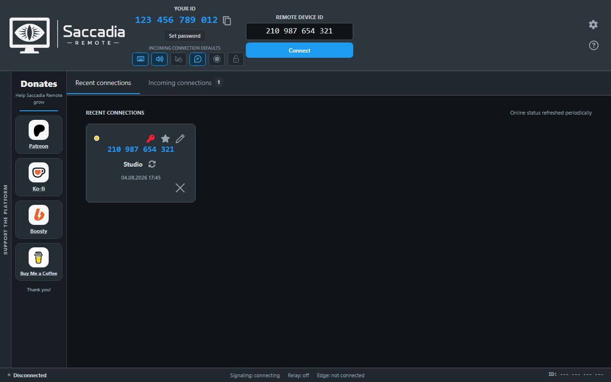
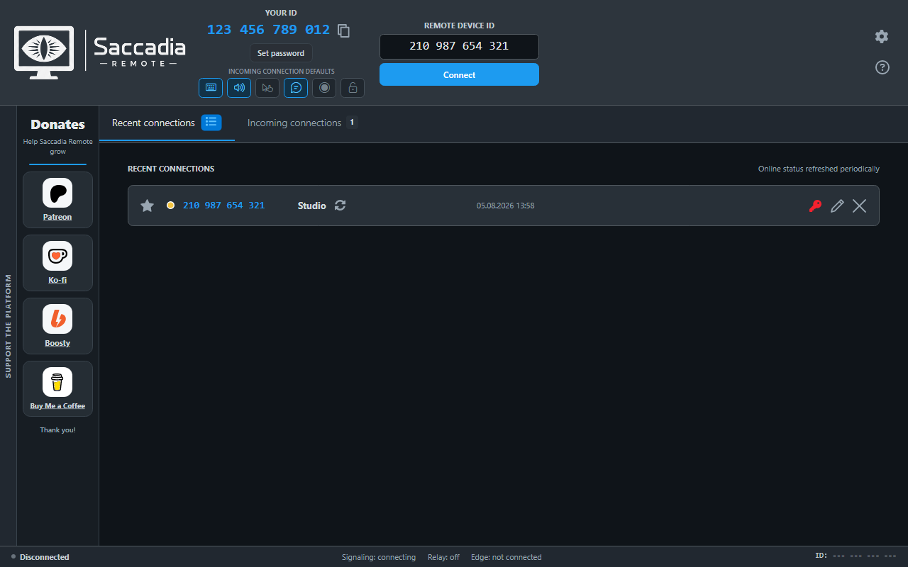
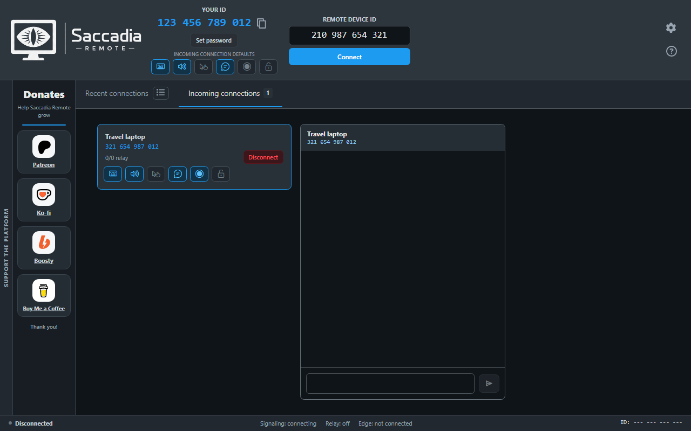
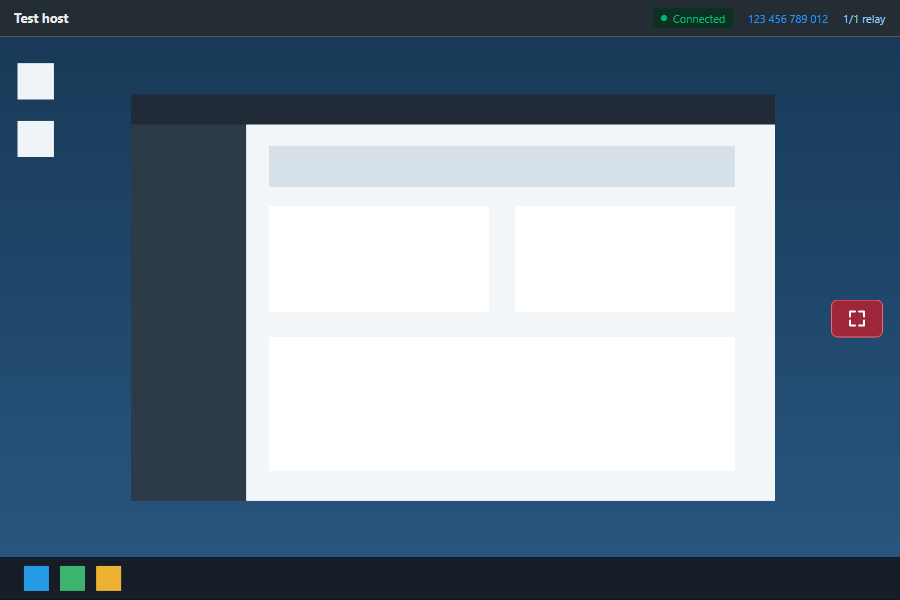
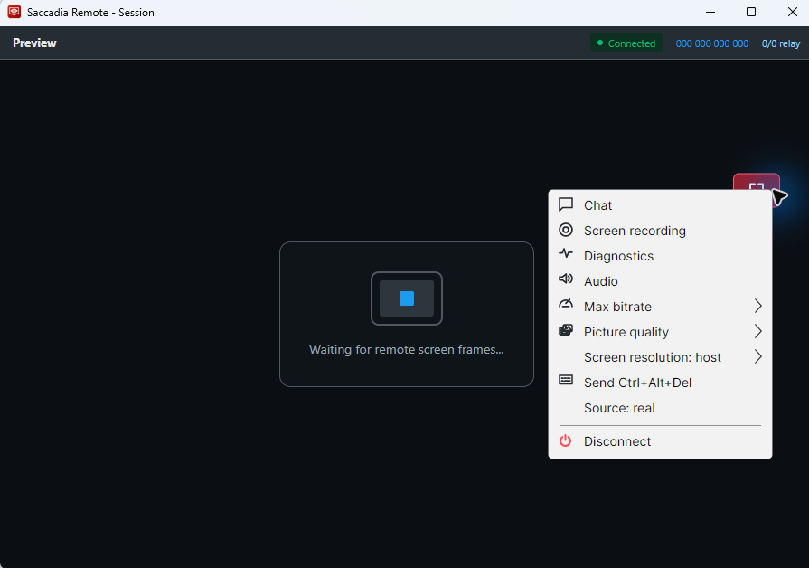
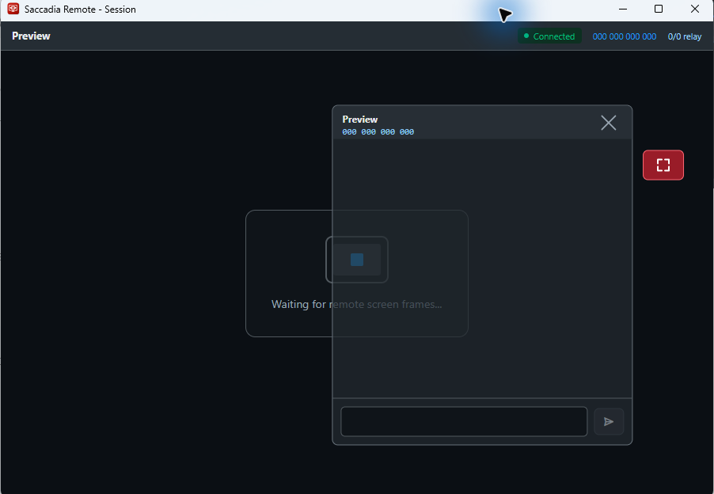
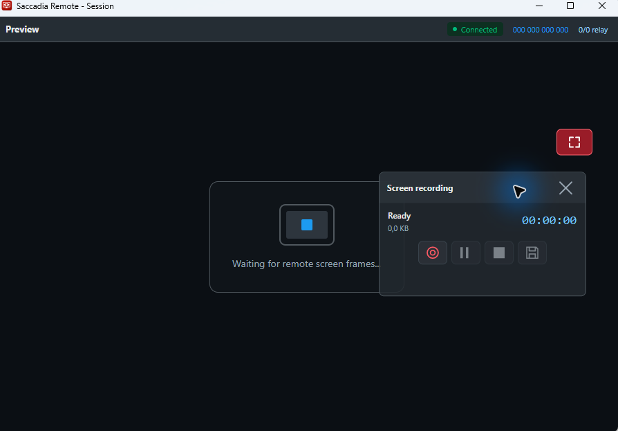
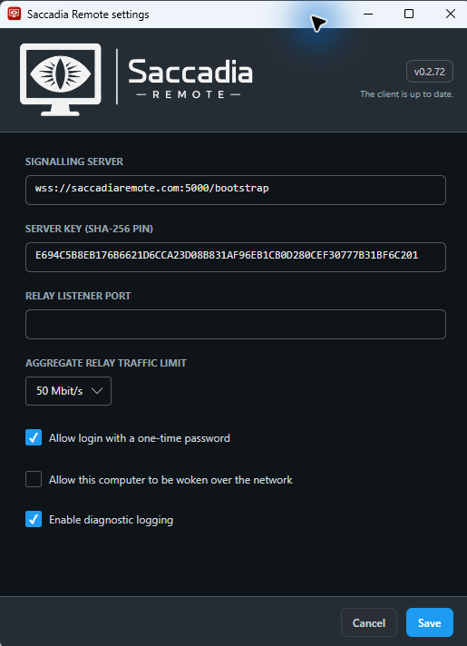

# Saccadia Remote User Guide

This guide explains how Saccadia Remote works, how to prepare a computer for access, and how to
start and manage a remote session. It is written for people using the application rather than for
server administrators.

The screenshots use fictional device IDs and names. No real user, server identity, password, or
private connection information is included.

## Contents

- [How Saccadia Remote works](#how-saccadia-remote-works)
- [Install a client you trust](#install-a-client-you-trust)
- [Understand the main window](#understand-the-main-window)
- [Prepare a computer for incoming access](#prepare-a-computer-for-incoming-access)
- [Connect to another computer](#connect-to-another-computer)
- [Manage recent connections](#manage-recent-connections)
- [Approve an incoming connection](#approve-an-incoming-connection)
- [Control an active remote session](#control-an-active-remote-session)
- [Use chat, recording, clipboard, and files](#use-chat-recording-clipboard-and-files)
- [Change application settings](#change-application-settings)
- [Review diagnostic logs and relay health](#review-diagnostic-logs-and-relay-health)
- [Troubleshoot a connection](#troubleshoot-a-connection)
- [Use Saccadia Remote safely](#use-saccadia-remote-safely)

## How Saccadia Remote works

Saccadia Remote connects two copies of the application:

- the **host** is the computer being viewed or controlled;
- the **viewer** is the computer used to connect to the host;
- the Saccadia infrastructure helps the two devices find each other and carries encrypted
  connection messages and, when needed, encrypted session packets.

In everyday use, the process is simple:

1. The host opens Saccadia Remote and shares its 12-digit device ID with a trusted person.
2. The viewer enters that ID and selects **Connect**.
3. The devices authenticate with a permanent password, a one-time password, saved authorization,
   or explicit approval on the host.
4. The two devices establish fresh encryption keys for that session.
5. The host sends its screen and optional audio; the viewer sends permitted input, chat, clipboard,
   or file data.

Normal session contents are encrypted on one participating device and decrypted on the other.
Coordinator, Edge, and relay services do not receive the session keys required to read the screen,
audio, input, clipboard, chat, or transferred files.

The network can use several relay paths at the same time. A route that becomes slow or unavailable
does not necessarily end the session because another path can continue carrying encrypted packets.
Relays can see ordinary delivery metadata such as addresses, timing, and traffic size, but not the
encrypted content. Saccadia Remote is a remote-access product, not an anonymity service.

For a more detailed explanation, see [Security and Encryption](SECURITY.md),
[Privacy](PRIVACY.md), and [How the system works](ARCHITECTURE.md).

## Install a client you trust

The only official public Saccadia Remote service is
[SaccadiaRemote.com](https://saccadiaremote.com). Its website provides a Windows client installer
already configured for that service.

1. Open the official website in your browser.
2. Download the client installer for your Windows architecture.
3. Read and accept the installer disclaimer.
4. Allow the installation to finish and start Saccadia Remote.

A self-hosting administrator can provide a client configured for a different server. In that case,
confirm the administrator and download source before installing it. A client from another server is
not an official-service client, even if the application looks the same.

Do not disable Windows Defender Firewall to make the application work. The installer registers the
required application and service rules. If a connection is blocked, check the firewall rules or ask
the server administrator for help instead of turning off system-wide protection.

## Understand the main window

The top part of the window contains the controls needed for most connections:

1. **Your ID** is the 12-digit address of this computer. Use the copy button to share it without
   retyping it.
2. **Set password** creates or changes the permanent password used to authenticate incoming
   connections.
3. **Incoming connection defaults** determine what a newly connected viewer may do. These defaults
   can be changed for each active incoming connection.
4. **Remote Device ID** is where you enter the host ID you want to reach.
5. **Connect** starts a connection attempt. **Cancel** stops an attempt that is still waiting.
6. **Recent connections** keeps useful local history. A tile or compact row can show availability,
   saved authorization, a favorite marker, a custom name, and the last connection time. The list
   button in the tab header switches between tiles and rows.
7. The bottom status bar shows whether the client is connected to signalling, whether its relay is
   available, and which Edge currently carries its signalling connection.

The gear button opens settings. The question-mark button opens the public project documentation in
your browser. When diagnostic logging is enabled, a log-list button appears below Help and opens the
local logs and relay-health window. Donation links are optional and do not affect application
features.

Closing the main window normally returns Saccadia Remote to the Windows notification area instead
of ending it. The tray menu provides **Open**, **Restart**, and **Exit**. **Restart** may request
Windows administrator confirmation because it restarts the Saccadia host and relay services before
opening a fresh client window. If confirmation is cancelled or a service cannot restart, the
original client remains open and reports the problem.

Availability is refreshed periodically. A recently disconnected computer can take a short time to
change from online to unavailable, and a computer that has just opened the application may need a
moment to become reachable.

## Prepare a computer for incoming access

Leave Saccadia Remote running on the computer you want to reach. The status bar should indicate that
signalling is connected and that an Edge is assigned.

### Choose an authorization method

**Permanent password**

Select **Set password**, enter a password, and confirm it. The password is kept on the participating
devices and is not sent to the signalling server. The devices use it to prove that they know the
same secret and to create fresh session keys.

**One-time password**

Enable **Allow login with a one-time password** in Settings. The main window then displays a short
temporary password that can be copied or refreshed. It is replaced after a successful use. Share it
only with the person who should connect now.

**Manual approval**

If no password is used, the host can explicitly accept or reject the request. Session traffic is
still encrypted, but this mode relies more strongly on the signalling service to introduce the
correct devices. Use a permanent or one-time password when stronger authentication is required.

### Choose default permissions

The six buttons under **Incoming connection defaults** control:

1. remote keyboard and mouse control, text clipboard, and file operations;
2. host audio streaming;
3. visibility of the physical host cursor;
4. viewer chat messages;
5. viewer-requested screen recording;
6. access to protected Saccadia controls on the host.

Blue means allowed; gray means not allowed. Grant only what the viewer needs. Protected Saccadia
controls are denied by default so a remote user cannot silently change access settings, reveal a
password, or activate sensitive application actions.

## Connect to another computer

1. Ask the host for its 12-digit **Your ID**.
2. Enter the digits in **Remote Device ID**. Spaces are added automatically.
3. Select **Connect**.
4. Enter the permanent or one-time password when requested, or wait for the host to approve the
   request.
5. If offered and appropriate for that computer, choose whether to remember authorization for a
   future automatic connection.

Saved authorization is not based only on the public device ID. The two devices retain a separate
protected secret and prove it again on later connections. You can remove saved authorization from
the key icon on a recent-connection tile.

Selecting a recent-connection tile fills its ID and starts the same normal connection process. Use
the star to keep an important computer easy to find and the pencil to give it a local friendly name.

## Manage recent connections

Recent connections are stored locally for convenience. The application retains up to 30 entries,
placing favorites first and then the most recently used computers.

Tiles are the default. Select the list button in the **Recent connections** tab header to switch to
compact rows; select it again to return to tiles. This choice is remembered after the application
restarts.

Each tile and row provides the same information and actions:

- the star marks or unmarks a favorite;
- the colored status dot shows the last known availability;
- selecting the ID, name, time, or another free area starts a connection;
- the key shows that saved authorization exists and lets you remove it;
- the pencil changes the local friendly name;
- the reset symbol restores the computer name reported by the remote device;
- the remove button deletes the entry from local history.

Selecting an action button performs only that action; it does not start a connection. Removing a
history entry does not uninstall Saccadia Remote, change the remote computer, or revoke saved
authorization; use the key action separately when you also want to remove that credential.

## Approve an incoming connection

When another user requests manual access, the host sees the viewer ID and can select **Accept** or
**Reject**. Verify the ID through a separate trusted channel before accepting an unexpected request.

After acceptance, the connection appears on the **Incoming connections** tab:

Each incoming card shows the viewer name, ID, and relay-path count. The six permission buttons are
the same controls described above, but changes here affect this active connection instead of future
defaults. Permissions can be enabled or withdrawn while the session is running.

Select an incoming card to open its host-side chat. Select **Disconnect** to end that viewer's
session. Removing saved authorization prevents that viewer from using the previous saved credential
again, but it does not replace the host's permanent password.

## Control an active remote session

The session header shows:

- the remote computer name;
- a green **Connected** indicator;
- the remote device ID;
- the number of active and available relay paths.

The large center area is the remote screen. Keyboard and mouse input are sent only when the host has
allowed remote control. The pointer controlled by this viewer follows the current cursor shape
reported by the host even when the separate **Show host cursor** permission is disabled.

**Show host cursor** controls an additional overlay for movement that did not come from the current
viewer. Physical mouse movement on the host appears without a label. Movement from another
Saccadia Remote session is labelled with that viewer computer's name, while movement injected by
Parsec or another external application is labelled **External**. Windows does not reliably identify
the process behind arbitrary injected mouse input, so Saccadia Remote does not guess an application
name. The current viewer's own movement is not duplicated as a host-cursor overlay.

### Use the session master button

The red floating button at the edge of the remote screen is the session **master button**. It keeps
the important viewer controls available even in fullscreen mode:

- **Left-click** it to switch between the maximized fullscreen view and normal windowed mode.
- **Right-click** it to open the session context menu.
- The button is **draggable**: hold the left mouse button and move it to any convenient place where
  it does not cover useful screen content. Its relative position and the fullscreen preference are
  remembered separately for that remote computer.

The context menu contains:

| Item | What it does |
| --- | --- |
| **Chat** | Opens or closes the encrypted session chat panel. |
| **Screen recording** | Opens the recording panel. This item is shown only when the host grants recording permission. |
| **Diagnostics** | Shows or hides live viewer-side playback and connection diagnostics over the remote screen. |
| **Audio** | Enables or mutes playback of sound received from the host. A check mark means audio is enabled. |
| **Max bitrate** | Limits the remote video stream from 1 Mbit/s up to the maximum supported by the current configuration. Unavailable values are disabled. |
| **Picture quality** | Uses adaptive quality or a fixed quality from 50% to 100%. Adaptive mode reacts to current transport conditions. |
| **Screen resolution** | Keeps the host's current resolution or requests a resolution matching the viewer display. The requested mode depends on host-platform support. |
| **Send Ctrl+Alt+Del** | Requests the secure attention sequence when the host platform and permissions allow it. |
| **Source: real/test** | Switches between the real remote desktop and the built-in test source used for troubleshooting. Select it again to return to the other source. |
| **Disconnect** | Ends the current remote session. |

Higher bitrate and picture quality can improve fine detail but require more network capacity. If the
picture becomes unstable on a slow connection, try adaptive quality or a lower bitrate before
changing unrelated system settings.

## Use chat, recording, clipboard, and files

**Chat** works independently from keyboard and mouse control when the host grants chat permission.
Messages are part of the encrypted session and are not stored as server-side chat history by the
standard service.

**Screen recording** is available only when the host permits it. Use the panel to start, pause,
stop, and save a recording. Treat recordings as sensitive files: the person operating the viewer is
responsible for consent, lawful use, storage, and sharing.

**Text clipboard** can synchronize supported copied text when remote-control/clipboard permission
is enabled. Avoid copying passwords or other secrets while a session is active unless the other
participant is intended to receive them.

**Files** can be transferred through supported clipboard and drag-and-drop operations when file
permission is enabled. Wait for a transfer to finish before moving or deleting the original file.
Transferred content is encrypted in the session, but the resulting local files have the normal
protection of the destination computer.

## Change application settings

The Settings window contains:

- the installed client version and update status;
- the signalling server address;
- the SHA-256 public key pin used to verify the configured server;
- an optional fixed relay listener port;
- the maximum total bandwidth this client contributes as a relay;
- one-time-password access;
- Wake-on-LAN participation;
- local diagnostic logging.

The screenshot shows the official public service address and its public verification pin. A pin is
not a password or private key: the client uses it to recognize the expected server. A provisioned
installer supplies the values needed for its own server. Do not change the server address or pin
unless a trusted server administrator gave you replacement values. A client configured for another
server joins that independent service.

Leave the relay listener port empty for automatic selection unless a network administrator requires
a fixed port. The aggregate relay limit controls forwarded encrypted traffic; it does not set the
quality of only one viewing session.

Wake-on-LAN is optional and publishes the network profile needed to request that this computer be
woken. Leave it disabled if you do not need it. Diagnostic logging is local and disabled by default;
logs can contain connection metadata, so review them before sharing.

## Review diagnostic logs and relay health

Select **Enable diagnostic logging** in Settings and then select **Save** when you need to
investigate a problem. A log-list button then appears below Help in the main window. Select it to
open the protected **Diagnostic logs** window.

The left side lists Saccadia Remote log files. Select one file to display its readable text preview
on the right. You can select and copy text from the preview. The checkbox beside each file marks it
for a file operation, and the checkbox in the list header selects or clears every listed file.

- **Copy selected** places the checked complete log files on the clipboard so they can be pasted
  into a folder or attached to a support message. If nothing is checked, the button becomes
  **Copy all**.
- **Delete selected** asks for confirmation and then cleans only the checked files. A log currently
  being written may be cleared and kept in place instead of being removed. Other failures are
  reported without stopping cleanup of the remaining files.
- The preview may show only the newest part of a very large log, but Copy exports the complete file.

The relay panel at the bottom reports the local Windows service, control channel, listener, active
relay pairs, UDP registration, warmup results, and the latest acknowledgement or failure. On
Windows it also checks every required product firewall rule and lists a missing or mismatched rule,
including its direction, protocol, profile scope, action, enabled state, and executable path. This
inspection is read-only: opening or refreshing the window never changes Windows Firewall and does
not contact the server for additional diagnostics.

Logs can contain device IDs, connection times, network addresses, and error details. Read them
before sharing, send only the files needed for the investigation, and disable logging again when
you no longer need it.

## Troubleshoot a connection

### The host appears unavailable

- Confirm that Saccadia Remote is open on the host.
- Check that the host status bar shows signalling connected and an assigned Edge.
- Confirm the complete 12-digit ID.
- Wait a few seconds after the host starts, then retry.
- If an old attempt continues waiting, select **Cancel** before starting another one.

### The application cannot reach the server

- Check ordinary Internet access and the system clock.
- Verify that the client came from the intended server.
- Ensure Windows Defender Firewall contains the installer-created Saccadia Remote rules. The
  **Diagnostic logs** window reports exactly which required rule is missing or misconfigured without
  changing it.
- Do not solve the problem by disabling the firewall globally.
- On a managed or filtered network, ask the administrator whether the configured service is allowed.

### A session connects but a feature does not work

- Check the corresponding permission on the host's **Incoming connections** card.
- For control, clipboard, or files, verify the first permission button.
- For sound, chat, cursor display, recording, or protected UI, verify its separate button.
- Open the session menu and check local Audio, bitrate, quality, and resolution choices.

### A relay is unavailable or missing

- Enable diagnostic logging, save Settings, and open the log-list button below Help.
- In the relay panel, check that the Windows service is running, the control channel is available,
  and UDP rendezvous is registered.
- Review the latest failure and warmup counts. The server retries an underfilled open session and
  migrates it when a relay reconnects with a new listener generation; normally you do not need to
  close and recreate the session. A path can remain below its target briefly while failure cooldown
  expires and the replacement is confirmed.
- **Restart** in the tray menu restarts the client and its local host/relay services and may restore
  a transient local state, but repeated failures should be investigated rather than hidden by
  disabling the firewall or other system protection.
- Copy only the relevant logs if you need to send the problem to support.

### The picture or sound is unstable

- Try adaptive picture quality or a lower maximum bitrate.
- Prefer a stable wired or strong Wi-Fi connection when possible.
- Check whether the relay count is falling or repeatedly returning to zero.
- Enable diagnostic logging only while reproducing a problem, then review the logs before sharing
  them with support.

## Use Saccadia Remote safely

- Install clients only from the official service or a self-hosting administrator you trust.
- Confirm a device ID before accepting an unexpected connection.
- Use a permanent or one-time password for stronger authentication.
- Grant only the permissions needed for the task.
- Remove saved authorization when a device or user should no longer reconnect.
- Keep Windows, security software, and Saccadia Remote updated.
- Do not expose passwords, one-time passwords, private keys, or unreviewed diagnostic logs.
- Remember that encryption cannot protect a device already controlled by malware or an untrusted
  application.

Saccadia Remote is provided as-is and does not replace backups, endpoint security, access control,
or an independent recovery method for important computers. Users are responsible for the systems
they connect to and for actions they perform or authorize. See the full
[Disclaimer](DISCLAIMER.md) and [Frequently Asked Questions](FAQ.md).
